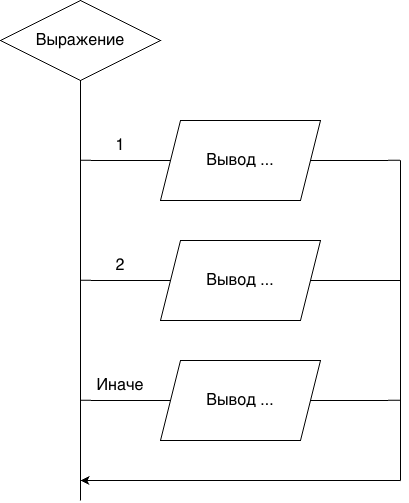

### Оператор выбора switch

Оператор switch используется для выбора одного из нескольких
вариантов действий в зависимости от того, с каким из набора шаблонов
совпадает значение некоторого выражения.
``` С
switch (выражение)
{
 case шаблон_1 : операторы;
 case шаблон_2 : операторы;
 …
 case шаблон_n : операторы;
}
```
Выражение должно принимать целочисленное значение типа:
типа long, int или char.

Отображение switch в схеме:

