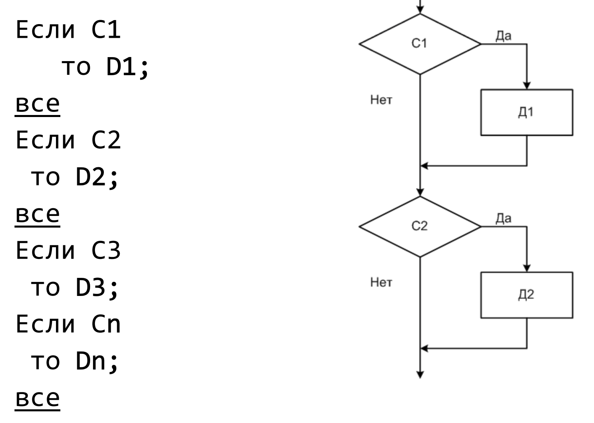
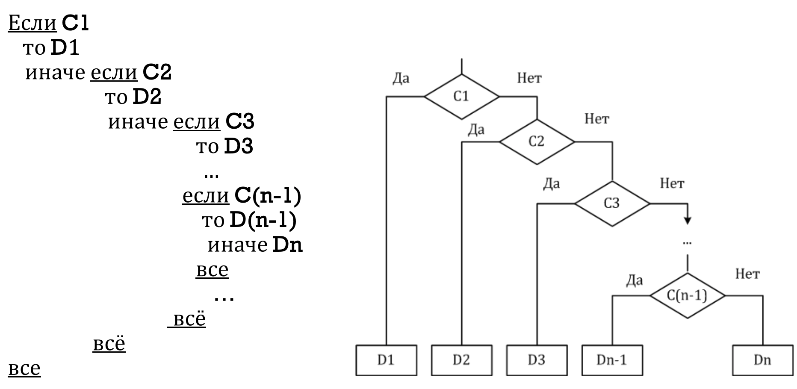

### Оператор выбора switch

Оператор switch используется для выбора одного из нескольких
вариантов действий в зависимости от того, с каким из набора шаблонов
совпадает значение некоторого выражения.
``` С
switch (выражение) {
case шаблон_1: операторы; break;
case шаблон_2: операторы; break;
 ….
case шаблон_(n-1); break;
default: операторы;
}
```
Выражение должно принимать целочисленное значение типа:
типа long, int или char.

Отображение switch в схеме:


### Команда ветвления if
Полная форма:
```
if (выражение)
 оператор_1;
 else оператор_2;
```

Сокращенная форма:
```
if (выражение)
 оператор_1;
```

В языке Си эквивалентны следующие выражения:
- (выражение)
- (выражение == true)
- (выражение != 0)
Используя операцию «НЕ» (!), можно также
записать эквивалентные выражения:
- (!выражение)
- (выражение == false)
- (выражение == 0)

# Запись команды выбора с помощью команд ветвления 
1 способ. Когда каждая ситуация анализируется независимо от
наступления или не наступления другой,

2 способ. Когда мы анализируем следующую ситуацию, учитывая
результат анализа предыдущей ситуации.

