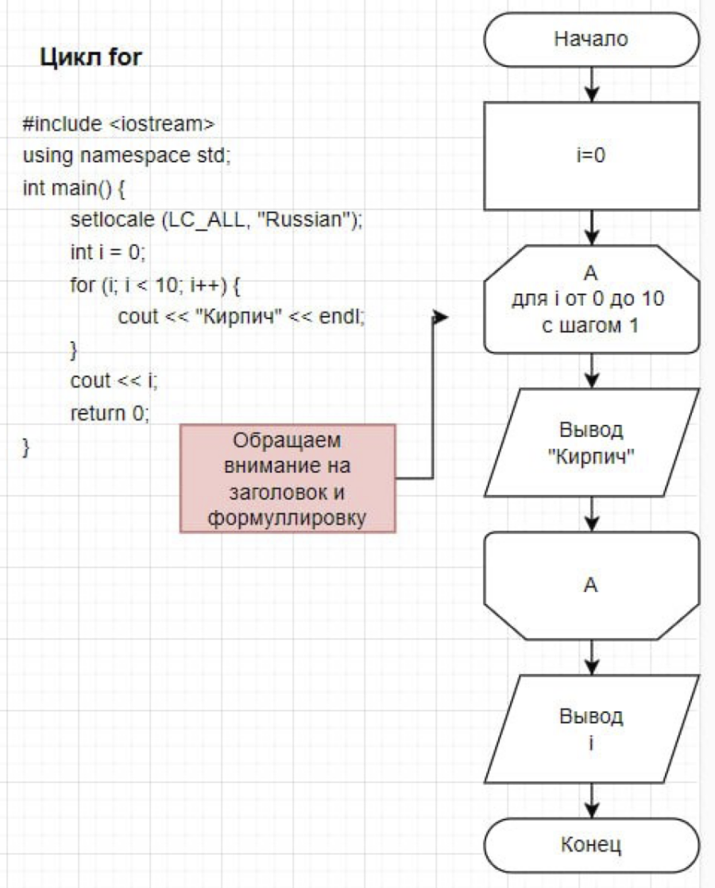
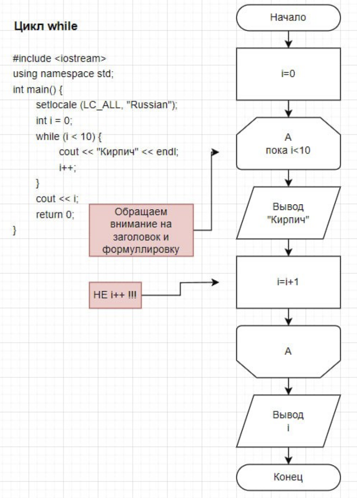

# Существует два вида циклов
## Цикл с известным кол-вом повторений
```
for (инициализация; условие; приращение) оператор;
```

инициализация, условие, приращение – это выражения языка Си.
Действия, выполняемые при операторе for:
  1.Вычисление выражения инициализация.
  2.Вычисление выражения условие:
    если условие ложно, то выполнение оператора for прекращается и управление передается оператору непосредственно следующему за for;
    если условие истинно, то выполняется тело цикла.
  3.Вычисление выражения приращение и выполнение переходит шагу 2. Приращение задает шаг изменения параметра цикла.

Особенности записи цикла for:
  1. После for обязательно «(»;
  2. Хотя инициализация, условие, приращение могут быть пропущены по отдельности или все вместе, однако соответствующие им «;» должны оставаться. Предельный случай (;;);
  3.Шаг изменения параметра цикла может быть любым.

Параметр цикла это переменная, которая задает количество повторений цикла.
Значения параметра цикла будут изменяться от начального значения, которое
определяется выражением инициализация, до конечного, которое указывается в
выражении условие. Тело цикла будет повторяться для каждого значения
параметра цикла

## Цикл с неизвестным количеством повторений (имеет также 2 вида)
# Цикл с предусловием
```
while (выражение){
      оператор;
}
```

В циклах с неизвестным числом повторений параметр цикла отсутствует. Для этих циклов необходимо «вручную» выполнить следующее:
  1. необходимо позаботиться, чтобы действия начались с нужной компоненты;
  2. надо позаботиться, чтобы на следующем выполнении цикла использовались новые данные (следующая компонента).

# Цикл с постусловием
