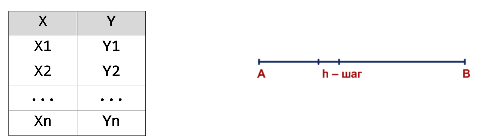
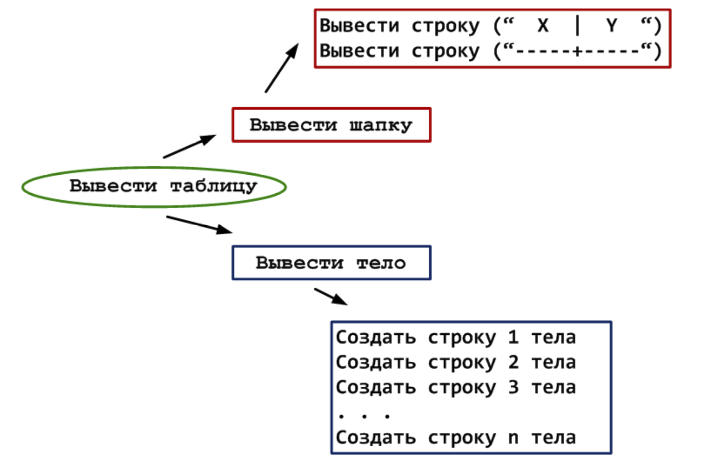
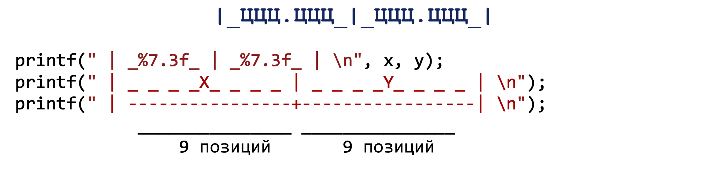

# Табулирование функций
Табулирование функций - построение таблиц функций.

Создание каждой строки на экране будет состоять из трех шагов:
  1. Получить текущее значение Х.
  2. Вычислить значение функции Y.
  3. Вывести значения X и Y.
В итого получим следующую последовательность действий:
  1 шаг
Х1 = А
Y1 = F(X1);
Вывести Х1 и Y1
  2 шаг
X2 = X1 + h
Вычислить Y2 = F(X2).
Вывести X2 и Y2
  3 шаг
X3 = X2 + h
Вычислить Y3 = F (X3)
Вывести X3 и Y3

Обобщенная запись для действий, начиная со второй строки:
Xi = Xi-1 + h
Вычислить Yi = F (Xi)
Вывести: Xi и Yi
То, что не удалось обобщить, нужно включить в подготовку цикла, и ее можно сразу
упростить: 
### Алгоритм:
X0 = A - h
Для i от 1 до n повторить
нач
 Xi = Xi-1 + h
 Вычислить Yi = F (Xi)
 Вывести: Xi и Yi
кон
В этом алгоритме остаются неизвестными 2 момента:
1)чему равняется n? n - число шагов.
2)как выводить строку со значением X и Y?
Для вычисления n имеется формула:
n = [(B - A) / h] + 1
После того, как определилось, как выводится каждая детальная строка в теле таблицы, необходимо уточнить вывод строк в шапке таблицы:

## Табулирование с помощью оператора while
Алгоритм в словесной форме:
  1. Ввести исходные данные: A, B, h
  2. Вывести заголовок таблицы
  3. Принять А в качестве первого значения аргумента: x = A
  4. Вычислить значение функции F(x)
  5. Вывести строку таблицы: текущее значение аргумента и соответствующее ему значение: x и F(x)
  6. Перейти к следующему значению аргумента x = x + h
  7. Если оно не превышает конечного значения В, повторить шаги 4-6, иначе закончить.
