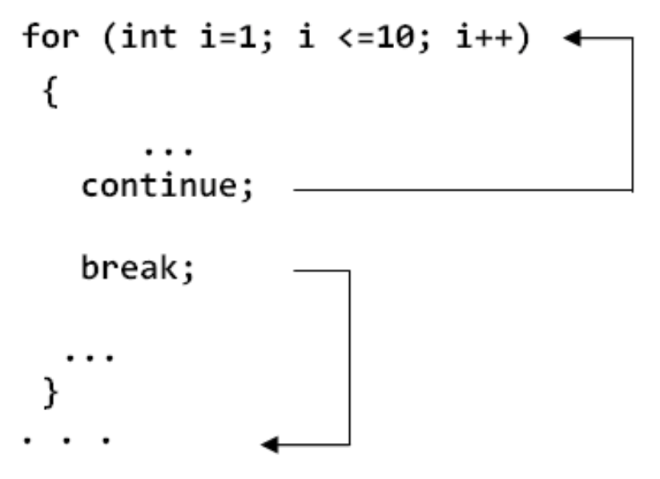

### Использование шаблонов при создании циклов
## Циклы, управляемые счетчиком
Циклы, управляемые счетчиком можно реализовать при помощи оператора while.
Шаблон для цикла, управляемом счетчиком:
```
int count = 0;
while (i - count <= конечное значение)
{
    <тело цикла>;
    count++;
}
```
Переменная-счетчик должна подвергнуться инициализации, проверке и модификации.

## Циклы, управляемые сигнальной меткой
Сигнальная метка – это уникальное значение входного данного, которое
обозначает окончание ввода и которое не может представлять собой обычный элемент данных.
Управляемый сигнальной меткой цикл перестает повторяться сразу после того, как была считана сигнальная метка.
Шаблон для цикла, управляемого сигнальной меткой
```
int n = 5; // сигнальная метка
while (i != n)
{
    <тело цикла>;
    Считать следующее значение и присвоить его входной переменной;
    i++;
}
```

## Циклы, управляемые boolean-флагами
Флаг – это переменная типа bool, значение которой указывает, произошло ли определенное событие. Значение флага должно быть первоначально установлено в false, а затем изменено на true, когда ожидаемое событие произойдет.
Соответственно, управляемый флагом цикл будет функционировать до тех пор, пока не случится соответствующее событие.
Шаблон для цикла, управляемого флагом:
```
bool flag = false;
while (!flag)
{
    <тело цикла>;
    Если ожидаемое событие произошло flag = true;
}
```

## Прерывания циклов
1. Оператор break - позволяет выполнить внезапный (одноуровневый) выход из
цикла.
 Синтаксис: break;
Оператор break используется для прерывания работы цикла. Встретив оператор break, программа немедленно завершает выполнение текущего цикла. Оставшиеся итерации цикла не выполняются. Управление передается первому оператору после текущего цикла.

3. Оператор continue выполняет следующее:
 - прерывается текущее выполнение тела цикла при текущем значении параметра цикла;
 - изменяется значение параметра цикла на следующее;
 - начинается следующая итерация цикла (со следующим значением параметра цикла).

Синтаксис: continue;

